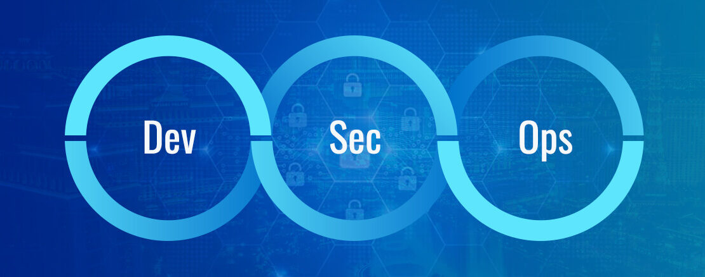

# DevSecOps
Providing Security in DevOps (The Effort to strive for "Secure by Default")

## 📜 Table of Contents
- [Roadmap](#-roadmap)
- [Tools](#-tools)
- [Resources](#resources)
  * [1. DevSecOps Overview](#1-devsecops-overview)
  * [2. Design](#2-design)
  * [3. Develop](#3-develop)
  * [4. Build](#4-build)
  * [5. Test](#5-test)
  * [6. Deploy](#6-deploy)
  * [7. Operations](#7-operations)
- [Other roadmaps](#-other-roadmaps)
- [Wrap Up](#-wrap-up)
- [Contributors](#contributors)
- [Contribute](https://github.com/hahwul/DevSecOps/blob/main/CONTRIBUTING.md)

## 💭 Roadmap

## 🔩 Tools 
Spending the time on applying DevSecOps searching, comparing, and making decisions about tools can be daunting. The tools listed here is a good starting point to help and assist and reduce unnecessary time and apply them quickly :sunglasses:

Open https://github.com/Lino-DC/DevSecOps/blob/main/tools/README.md

## 📦 Resources
### 1. DevSecOps Overview