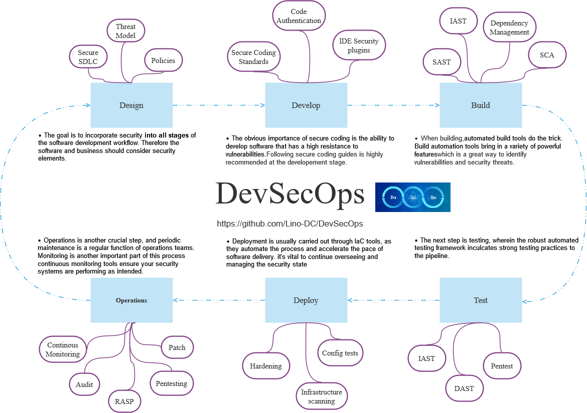

# DevSecops
Providing Security in DevOps (The Effort to strive for "Secure by Default")

## 📜 Table of Contents
- [Roadmap](#-roadmap)
- [Tools](#-tools)
- [Resources](#resources)
  * [1. DevSecOps Overview](#1-devsecops-overview)
    * [1.1 What is DevSecOps](#1.1-what-is-devsecops)
  * [2. Design](#2-design)
  * [3. Develop](#3-develop)
  * [4. Build](#4-build)
  * [5. Test](#5-test)
  * [6. Deploy](#6-deploy)
  * [7. Operations](#7-operations)
- [Other roadmaps](#-other-roadmaps)
- [Wrap Up](#-wrap-up)
- [Contributors](#contributors)
- [Contribute](https://github.com/hahwul/DevSecOps/blob/main/CONTRIBUTING.md)

## 💭 Roadmap

## 🔩 Tools 
Spending a lot of time on applying DevSecOps is searching, comparing, and making decisions about tools. These tool lists are a good way to help you reduce unnecessary time and apply them quickly :sunglasses:

Open https://github.com/Lino-DC/DevSecOps/blob/main/tools/README.md

## 📦 Resources
### 1. DevSecOps Overview
  - Overview
    1. [DevSecOps in Wikipedia](https://en.wikipedia.org/wiki/DevOps#DevSecOps,_Shifting_Security_Left)
    2. [Zero to DevSecOps (OWASP Meetup)](https://owasp.org/www-chapter-belgium/assets/2019/2019-02-20/Zero-to-DevSecOps-OWASP-Meetup-02-19-19.pdf)
    3. [DevSecOps What Why And How (BlackHat USA-19)](https://i.blackhat.com/USA-19/Thursday/us-19-Shrivastava-DevSecOps-What-Why-And-How.pdf)
    4. [DevSecOps – Security and Test Automation (Mitre)](https://www.mitre.org/sites/default/files/publications/pr-19-0769-devsecops_security_test_automation-briefing.pdf)
### 1.1 What is DevSecOps    
### 2. Design
  - Development Lifecycle
    1. [SDL(Secure Development Lifecycle) by Microsoft](https://www.microsoft.com/en-us/securityengineering/sdl/practices)
    2. [DevSecOps basics: 9 tips for shifting left (Gitlab)](https://about.gitlab.com/blog/2020/06/23/efficient-devsecops-nine-tips-shift-left/)
    3. [6 Ways to bring security to the speed of DevOps (Gitlab)](https://about.gitlab.com/blog/2019/10/31/speed-security-devops/)
  - Threat Model
    1. [What is Threat Modeling / Wikipedia](https://en.wikipedia.org/wiki/Threat_model)
    2. [Threat Modeling by OWASP](https://owasp.org/www-community/Threat_Modeling)
    3. [Application Threat Modeling by OWASP](https://owasp.org/www-community/Application_Threat_Modeling)
    4. [Agile Threat Modeling Toolkit](https://threagile.io)
    5. [OWASP Threat Dragon](https://threatdragon.github.io)
### 3. Develop
  - Secure Coding
    1. [Secure coding guide by Apple](https://developer.apple.com/library/archive/documentation/Security/Conceptual/SecureCodingGuide/Introduction.html)
    2. [Secure Coding Guidelines for Java SE](https://www.oracle.com/java/technologies/javase/seccodeguide.html)
    3. [Go-SCP / Go programming language secure coding practices guide](https://github.com/OWASP/Go-SCP)
    4. [Android App security best practices by Google](https://developer.android.com/topic/security/best-practices)
    5. [Securing Rails Applications](https://guides.rubyonrails.org/security.html)
### 4. Build  
  - SAST(Static Application Security Testing)
    1. [Scan Source Code using Static Application Security Testing (SAST) with SonarQube, Part 1](https://medium.com/nycdev/scan-your-source-code-for-vulnerabilities-using-static-application-security-testing-sast-with-5f8ee1fdf9aa)
    2. [Announcing third-party code scanning tools: static analysis & developer security training](https://github.blog/2020-10-05-announcing-third-party-code-scanning-tools-static-analysis-and-developer-security-training/)
### 5. Test
  - DAST(Dynamic Application Security Testing)
    1. [Dynamic Application Security Testing with ZAP and GitHub Actions](https://www.zaproxy.org/blog/2020-05-15-dynamic-application-security-testing-with-zap-and-github-actions/) 
    2. [Dynamic Application Security Testing (DAST) in Gitlab](https://docs.gitlab.com/ee/user/application_security/dast/)
    3. [DAST using pdiscoveryio Nuclei (github action)](https://github.com/secopslab/nuclei-action)
    4. [ZAPCon 2021-Democratizing ZAP with test automation and domain specific languages](https://youtu.be/jimW-R6_F4U)
  - Penetration testing
    1. [Penetration Testing at DevSecOps Speed](https://securityboulevard.com/2019/04/penetration-testing-at-devsecops-speed/)
### 6. Deploy
  - Security Hardening & Config
    1. [CIS Benchmarks](https://www.cisecurity.org/cis-benchmarks/)
  - Security Scanning
    1. [Best practices for scanning images (docker)](https://docs.docker.com/develop/scan-images/)
### 7. Operations
  - RASP(Run-time Application Security Protection)
    1. [Runtime Application Self-Protection by rapid7](https://www.rapid7.com/fundamentals/runtime-application-self-protection/)
    2. [Jumpstarting your devsecops - Pipeline with IAST and RASP](https://2018.appsec.eu/presos/DevOps_Jumpstarting-Your-DevSecOps_Jeff-Williams_AppSecEU2018.pdf)
  - Security Patching
  - Security Auditing
  - Security Continous Monitoring
  - Security Analysis

## 🚀 Other roadmaps
|  |  |
| ------------------------------------------------------------ | ------------------------------------------------------------ |
|   U.S. Department of Defense           | Larry Maccherone                                       |
|  |  | 
| The DevSecOps Security Checklist | Gitlab security devops diagram | 

## 🙏🏼 Wrap Up
#If you think the roadmap can be improved, please do open a PR with any updates and submit any issues. Also, #I will continue to improve this, so you might want to star this repository to revisit.